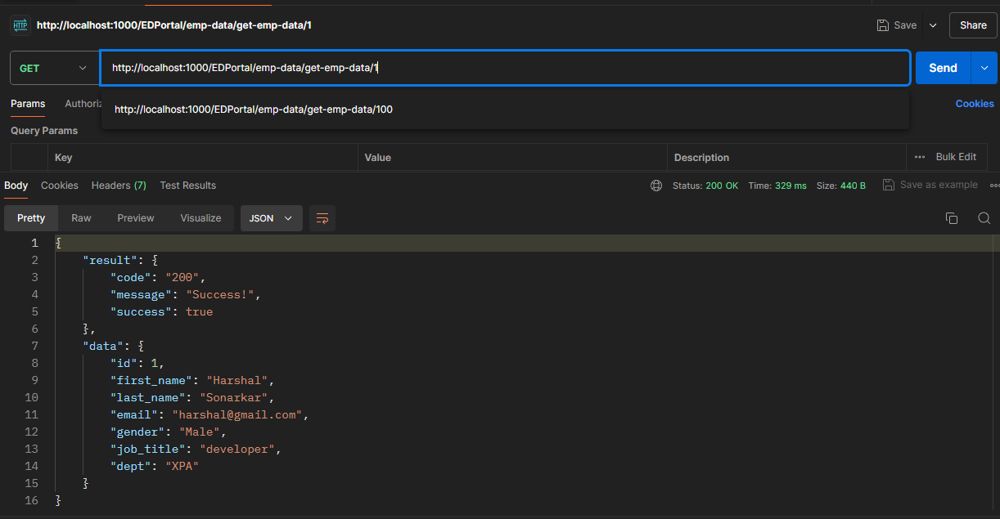

# Backend Development using Node.js, Express and Postman

Understanding of Node JS and express, exposing data using API endpoints. Using POSTMAN for testing the API, using various HTTP Methods GET, POST, PUT, DELETE. Using DB Adapter for communicating between MySQL database and JSON data.


## Documentation

Node.js is javascript framework which runs on chrome's V8 engine, it helps to run the javascript code outside the browser, and used for server side scripting. This project will help you understand the basics of node js creating a server using express and performing CRUD opertion on database. an industry level layered architecture used in this project which provides simplicity, easy to understand, debug and code reusability can be achieved.

1. What is API?
API stands for Application Programming Interface. API's are mechanism which allows two software components or computers to communicate with each other using standard sets of definitions or protocols. e.g. We have a weather app in our mobile which communicates with weather app's server to fetch the realtime weather data using APIs.

2. What is Node.js?
Node.js is javascript framework which is developed by Ryan Dahl for developing server side applications. Node.js uses chrome's V8 engine and can be run outside the browser. Amongst programmers Node.js is very popular framework used for backend development.

3. What is Express?
Express is routing framework which allows user to build single page, multi page server applications. It's a backend development framework which is used to develop RESTful API's with Node.js. Using Express a user can simplify the routing process, result's in high performance server code which is very helpful for any developer.

4. What is POSTMAN?
POSTMAN is software platform which is useful for builing, testing, and collaborating on API's. POSTMAN provides a user friendly interface through which user can test their API, it helps user to boost the testing and development process.

* Application Architecture :


* Let's discuss about various layers of our Application :
1) Client : This layer is front-end or user layer through which user will request some resource. e.g Browser a user can request some website or content through browser which can be act as client layer.

2. API : API layer handles incoming requests from the client. It receives Http requests, and routes the requests to the controller layer. include middlewares for authentication, validation etc. 

3. Controller Layer :
Manages the flow of data into and out of the service layer. It interprets the requests from the API layer, Calls the necessary functions in the service layer, Prepares and sends responses back to the API layer.

4. Service layer : It contains the core business logic of the application. Processes data and handles complex operations, also interacts with the data layer via the DB Manager. 

5. DB-Manager layer: 
It acts as an bridge between the service layer and the database adapter. This layer provides an abstraction over direct database operations. Calls the DB Adapter to execute database queries.

6. DB Adapter layer: This layer handles direct interactions with the database. It executes CRUD (Create, Read, Update, Delete) operations, Converts high-level data operations into database queries, Interfaces with different types of databases, such as SQL, NoSQL, or cloud-based databases.

## Installation

Clone Git Repo

```bash
git Clone https://github.com/Harsh5661/Node_POC.git

```
```bash
Open Visual Studio Code
```
```bash
Open project Node_POC
```
```
Run npm start
```
Note: Make sure you're PORT 1000 is free or you can change the PORT no. in index.js file.
## Usage/Examples

* The application is tested in two different modules :
1. Using MySQL database:
first, you need to install mysql in your machine, or you can use XAMPP server for the same. Here is the official link of MySQL and XAMPP:
https://www.mysql.com/
https://www.apachefriends.org/

After that update the line in index.js file to use mysql database.
```
const dataSource = process.env.DATA_SOURCE || 'mysql';
```
-> Start mysql server. You can use cmd tool or workbench to execute the database.
```
Run create database emp_data;
```
```
use emp_data;
```
```
CREATE TABLE employees (
    ->     id INT AUTO_INCREMENT PRIMARY KEY,
    ->     first_name VARCHAR(255),
    ->     last_name VARCHAR(255),
    ->     email VARCHAR(255),
    ->     gender VARCHAR(10),
    ->     job_title VARCHAR(255),
    ->     dept VARCHAR(255)
    -> );
```
```
show table;
```
Now, you successfully created the database for our Node application. 

-> Next, Open POSTMAN tool. and you can perform the CRUD operations using GET, POST, PUT, DELETE methods using our custom API's.
Here are the list of API's for performing various operations :
```
http://localhost:1000/EDPortal/emp-data
```
For fetching the entire employees records.
```
http://localhost:1000/EDPortal/emp-data/:id
```
For fetching specific record from employees table.
```
http://localhost:1000/EDPortal/emp-data/add-emp-data
```
For adding data to the employees table.
```
http://localhost:1000/EDPortal/emp-data/edit-emp-data/:id
```
For updating the existing data record in employees table.
```
http://localhost:1000/EDPortal/emp-data/delete-emp-data/1
```
For deleting a record from the employees table.

2. Using JSON data:
There is emp_data.json file in Node_POC/data/emp_data.json which you can use to test the application.
Just you have to update the line in index.js as:
```
const dataSource = process.env.DATA_SOURCE || 'json';
```
And you are ready with using JSON data to perform test the APIs on POSTMAN with various HTTP methods. 

Note: all the api path are same for mysql and json data.
## Screenshots
1. GET Method// GET By id
   
   
2. POST Method
   
3. PUT Method
   
4. DELETE Method
   

## Contributing

Contributions are always welcome!

You can use this sample to customize you're app.

Please read Node.js Library License Usage and Policies.

Please adhere to this project's `code of conduct`.

